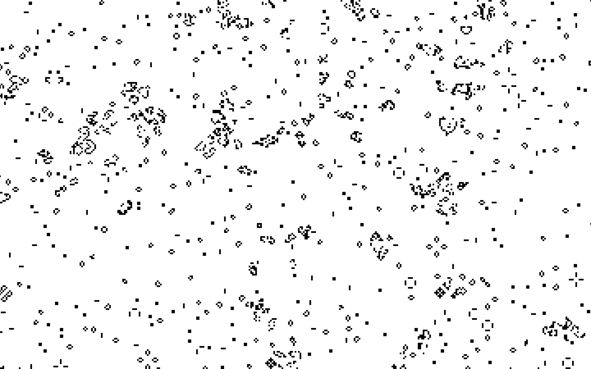

# Introduction

This is an implementation of [Conway's Game of Life](https://en.wikipedia.org/wiki/Conway%27s_Game_of_Life) written for the [Bevy](https://bevyengine.org) game engine. One notable difference is that the world is not infinite, which helps keep the frame rate up.

# Controls

| Key | Description |
| --- | ----------- |
| Left Arrow | Zoom the camera out. |
| Right Arrow | Zoom the camera in. |
| W | Move the camera up. |
| A | Move the camera left. |
| S | Move the camera down. |
| D | Move the camera right. |
| R | Reset the simulation. |
| Space | Pause / unpause the simulation. |

# Systems

This section briefly describes each of the systems.

## Setup System

This used to initialize the simulation after setting up the scene, but now just does the latter. The sim initialization logic was moved to another system that can be run more than once to allow for resetting the sim while the app is running.

## Init System

The init system populates an initial finite grid of cells. Any cell that is randomly determined to be "alive" gets a sprite and a GridPosition component. Sometimes the initial state won't be "interesting" enough to exhibit dynamic behavior. If this happens, simply reset the simulation with the `R` key. If you find yourself doing this too often, you can modify the chance that a cell will be granted life.

## Simulation System Set

All of the systems that perform the simulation are contained in a system set, so that the sim can be paused / unpaused easily.

### Count Neighbors System

This system iterates through all living cells (which are entities with the GridPosition component) and increments the neighbor count for each of the neighboring grid positions. It also adds this cell to a HashSet which is used to track living cells. All of this bookkeeping data is stored in the GridState resource.

### Spawn System

The spawn system iterates over the neighbors map contained in the GridState resource (this map was updated by count neighbors system) and determines if a new cell needs to be spawned for that grid position. It uses data from the GameRules resource to make this decision. If the game rules indicate that a cell should "regenerate" at this position (because there are 3 living neighbors) then a command is queued up to spawn an entity at that grid position. This only happens if there is no entity already living at that position, which is determined by consulting the HashSet.

### Despawn System

The despawn system iterates over all the cell entities with a query that includes the entity ID and the GridPosition component. It first checks to see if the cell is within the finite world bounds (just a radius around the grid origin, (0, 0)) and marks it for despawning if it is outside of them. Next it checks if the cell has too few or too many neighbors. Either condition spell certain doom for the cell. If the cell will not live past this round, a desapawn command is queued up for that entity.

## Input Systems

User input is handled by several separate systems.

### Camera Zoom System

The camera zoom level is controlled by this system, which runs on each `OrthographicProjection` in the world.

### Camera Move System

The camera move system updates the `Transform` component on entities that also have the `OrthographicProjection` component.

## Reset System

This system simply sets the app state to `AppState::Init`, which will reinitialize the simulation.

### Pause System

This system uses the application state machine to pause / unpause the simulation.